# BudgetFlow 💸 

BudgetFlow is a modern, offline-first Progressive Web Application (PWA) for personal finance management. Built with a Go Fiber backend and a Next.js 16 frontend, it lets you track income and expenses, manage categories, and review your financial health — even without an internet connection.

---

## ✨ Features

- **Offline-First Architecture** — Powered by IndexedDB (Dexie.js). Log transactions anywhere; changes sync automatically when you're back online.
- **Smart Sync Queue** — Pending writes are queued locally and pushed to the server the moment connectivity is restored, with conflict resolution built in.
- **Dashboard Analytics** — Pie charts, line charts, and an at-a-glance income vs. expense summary powered by Recharts.
- **Transaction Management** — Add, filter (All / Income / Expense), and browse transactions grouped by date. Supports receipt image attachment.
- **Category Management** — Create and edit colour-coded, icon-tagged income and expense categories. Pick from a curated palette and icon set.
- **Settings** — Toggle dark mode, switch default currency, and manage localization preferences — all persisted locally.
- **Full Auth Flow** — Register → Email Verification → Login → Forgot Password → Reset Password, all with secure HTTPOnly JWT cookies.
- **Editorial-Grade UI** — Minimalist, modern design system: `#0058be` primary blue, `#131b2e` dark, `#faf8ff` surface. Consistent `10px` component radius, staggered entry animations, and glassmorphic landing page.
- **Docker-Ready** — One `docker compose up` starts Postgres, the Go API, and the Next.js frontend together.

---

## 📸 Screenshots

### Core Experience

| Landing Page (Desktop) | Landing Page (Mobile) |
| :---: | :---: |
| 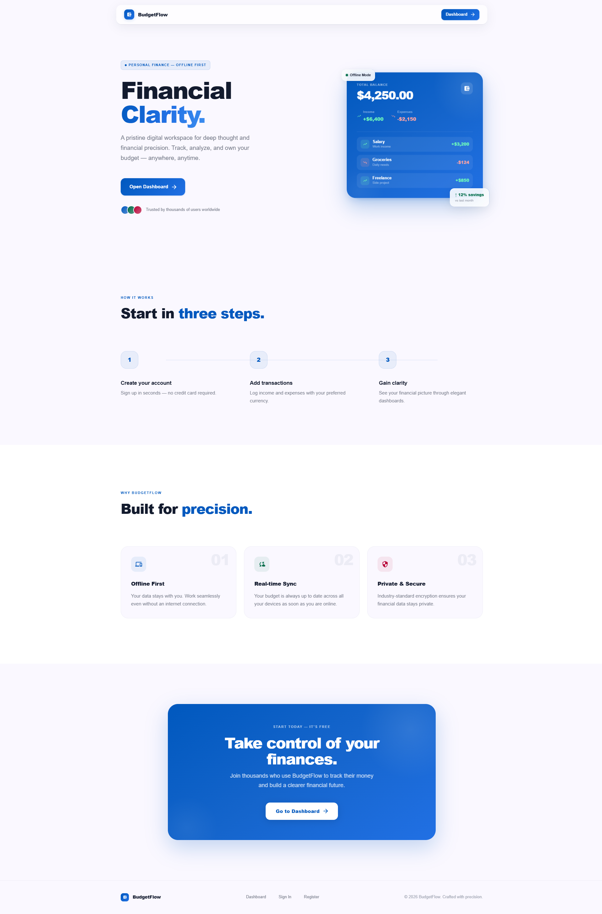 | 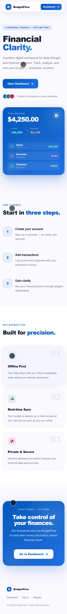 |

| Dashboard (Desktop) | Dashboard (Mobile) |
| :---: | :---: |
| 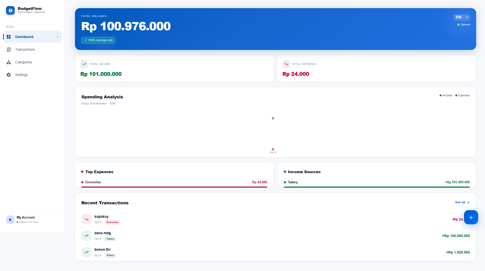 | 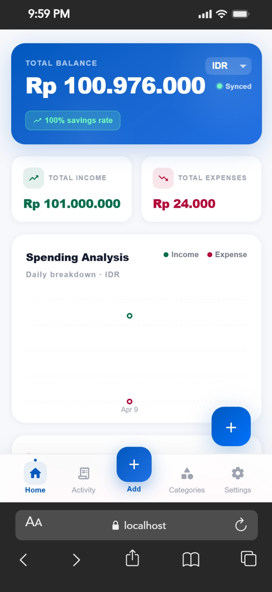 |

| Transactions (Desktop) | Transactions (Mobile) |
| :---: | :---: |
| 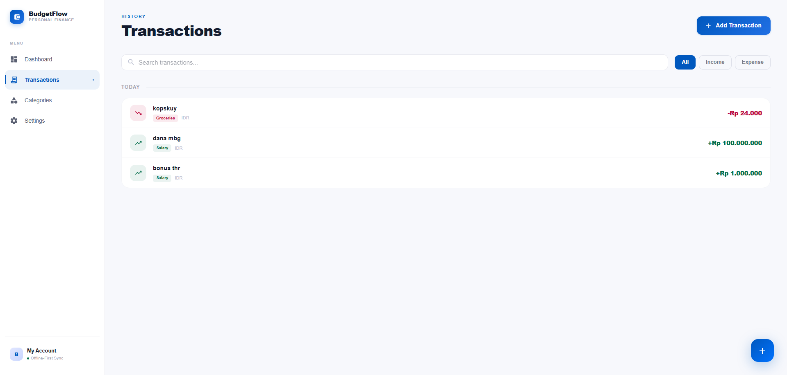 | 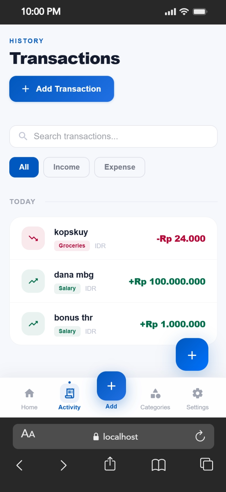 |

### Management & Settings

| Add Transaction (Desktop) | Add Transaction (Mobile) |
| :---: | :---: |
| 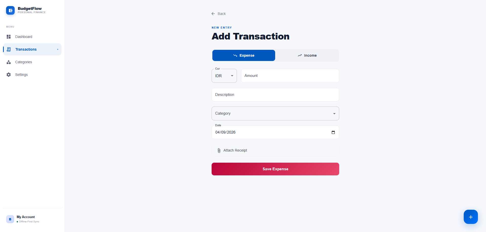 | 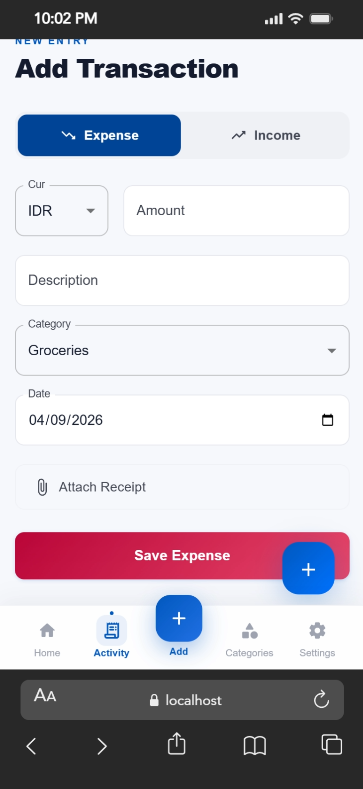 |

| Categories (Desktop) | Categories (Mobile) |
| :---: | :---: |
| 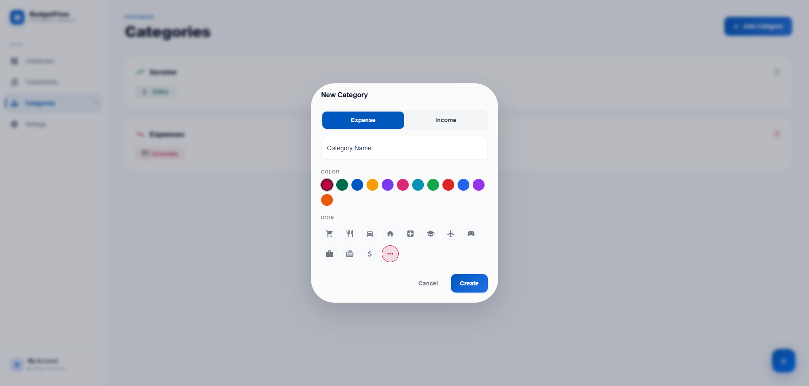 | 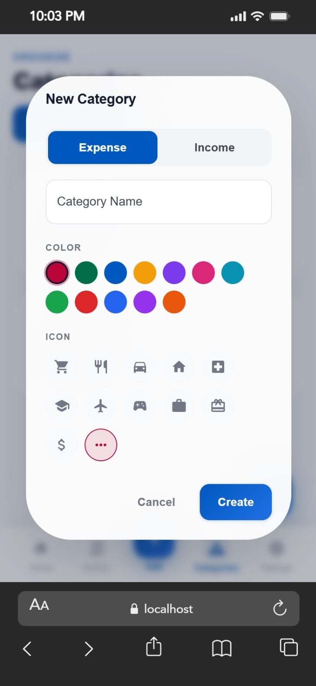 |

| Settings (Desktop) | Settings (Mobile) |
| :---: | :---: |
| 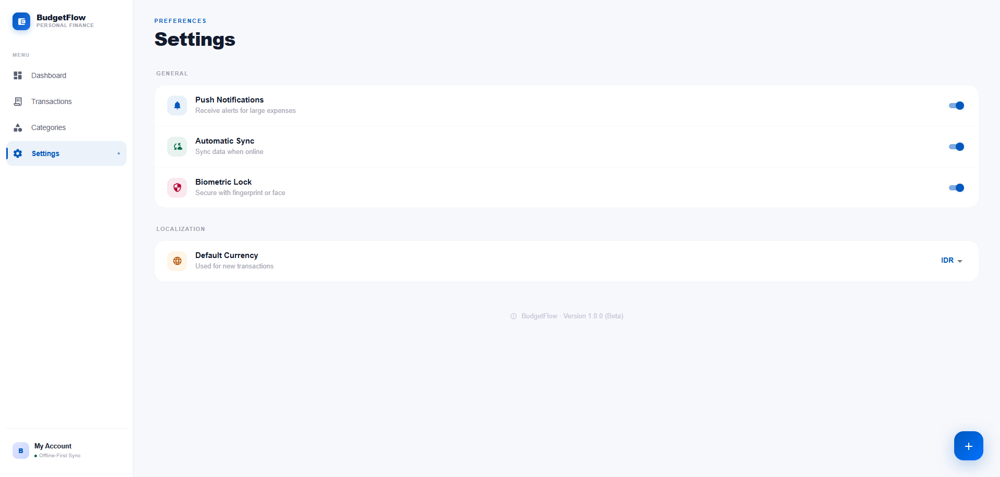 | 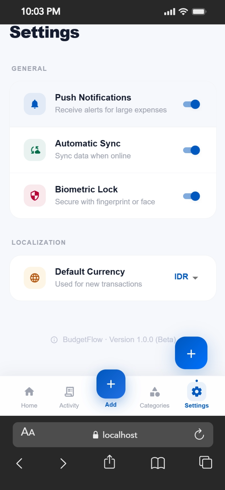 |

### Authentication

| Login (Desktop) | Login (Mobile) |
| :---: | :---: |
| 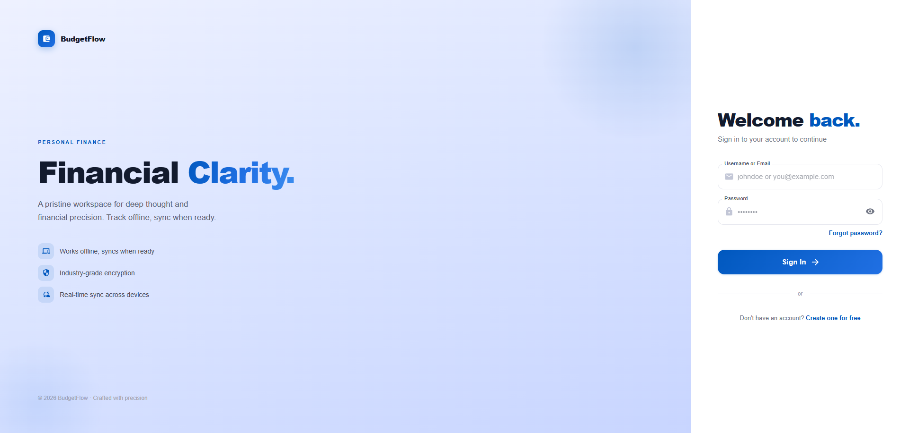 | 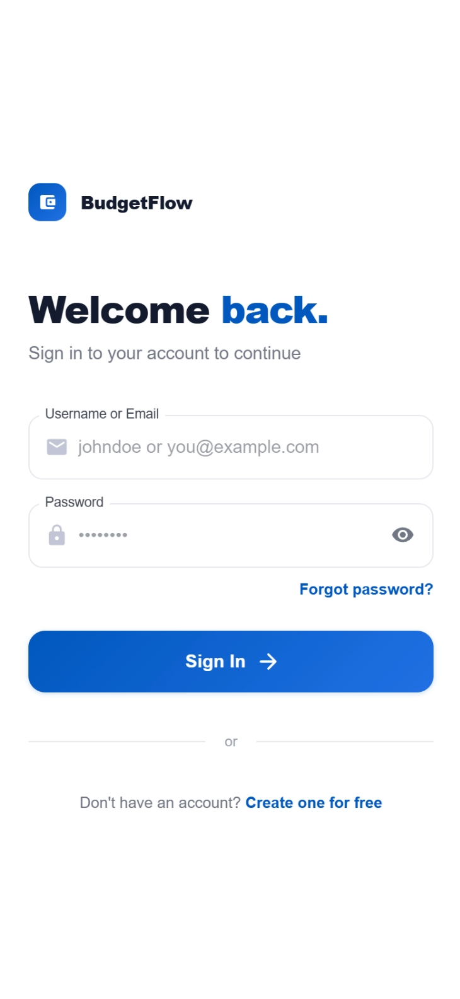 |

> Screenshots are located in `client/public/screenshots/`. 

---

## 🛠️ Technology Stack

### Frontend (`/client`)

| Layer | Technology |
|---|---|
| Framework | Next.js 16 (App Router) |
| Language | TypeScript |
| UI Components | Material UI (MUI v7) |
| Forms | @tanstack/react-form + Zod |
| Offline Storage | Dexie.js (IndexedDB) |
| Charts | Recharts |
| Runtime | Bun |

### Backend (`/backend`)

| Layer | Technology |
|---|---|
| Framework | Go Fiber |
| Database | PostgreSQL 16 (pgx driver) |
| Auth | JWT (HTTPOnly cookies) + bcrypt |
| API Docs | Swagger (swaggo/swag) |

---

## 🚀 Quick Start

### Option A — Docker (Recommended)

```bash
# 1. Copy and configure environment variables
cp .env.example .env
# Edit .env: set DB_PASSWORD, JWT_SECRET, SMTP_* values

# 2. Start all services
docker compose up --build
```

| Service | URL |
|---|---|
| Frontend | http://localhost:3000 |
| Backend API | http://localhost:8000 |
| Swagger Docs | http://localhost:8000/swagger |

---

### Option B — Local Development

#### Prerequisites
- Go 1.22+
- PostgreSQL 16+
- [Bun](https://bun.sh/)

#### 1. Database

```bash
# Create the database
psql -U postgres -c "CREATE DATABASE budget_db;"

# Run migrations in order
psql -U postgres -d budget_db -f backend/db/migrations/001_create_users_table.sql
psql -U postgres -d budget_db -f backend/db/migrations/002_create_categories_table.sql
psql -U postgres -d budget_db -f backend/db/migrations/003_create_transactions_table.sql
```

Migration files live in `backend/db/migrations/` and are plain SQL — no migration tool required. Run them once in order, and you're done.

#### 2. Backend

```bash
cd backend
cp .env.example .env   # Set DATABASE_URL, JWT_SECRET, SMTP_* etc.
go mod tidy
go run cmd/api/main.go
# API running at http://localhost:8000
```

#### 3. Frontend

```bash
cd client
bun install
bun run dev
# App running at http://localhost:3000
```

---

## 📁 Project Structure

```
budget-tracking-app/
├── backend/              # Go Fiber API
│   ├── cmd/api/          # Entry point (main.go)
│   ├── internal/
│   │   ├── handlers/     # HTTP route handlers
│   │   ├── middleware/   # Auth, CORS, etc.
│   │   └── models/       # DB models
│   └── docs/             # Swagger generated docs
│
├── client/               # Next.js 16 frontend
│   └── app/
│       ├── (dashboard)/  # Protected pages (layout with Sidebar)
│       │   ├── dashboard/     # Overview, charts
│       │   ├── transactions/  # List + new transaction page
│       │   ├── categories/    # Category management
│       │   └── settings/      # User preferences
│       ├── auth/         # Public auth pages
│       │   ├── login/
│       │   ├── register/
│       │   ├── forgot-password/
│       │   ├── reset-password/
│       │   └── verify/
│       ├── components/   # Shared components
│       │   ├── Sidebar.tsx
│       │   ├── MobileNav.tsx
│       │   ├── TransactionDialog.tsx   # FAB quick-add dialog
│       │   ├── NetworkProvider.tsx     # Online/offline context
│       │   └── GlobalAddButton.tsx
│       ├── lib/
│       │   ├── db.ts       # Dexie (IndexedDB) schema & helpers
│       │   ├── api.ts      # Axios instance
│       │   └── validators.ts  # Zod schemas
│       ├── theme.ts        # MUI theme (design tokens)
│       └── globals.css     # Base styles & animations
│
└── docker-compose.yml    # Orchestrates postgres + backend + frontend
```

---

## 📖 API Documentation

Swagger UI is auto-generated from handler annotations:

```
http://localhost:8000/swagger
```

To regenerate after editing handlers:

```bash
cd backend
swag init -d internal/handlers,cmd/api -o docs
```

---

## 🔐 Authentication Flow

1. **Register** — username, email, and password. A verification token is emailed.
2. **Verify Email** — confirm the token to activate your account.
3. **Login** — sign in with username or email. JWT stored in an HTTPOnly cookie.
4. **Forgot Password** — request a secure reset link via email.
5. **Reset Password** — submit your new password using the token from the link.

---

## 🎨 Design System

The UI follows an editorial-grade minimalist aesthetic:

| Token | Value |
|---|---|
| Primary | `#0058be` |
| Dark | `#131b2e` |
| Surface | `#faf8ff` |
| Income accent | `#006c49` |
| Expense accent | `#b90538` |
| Border radius | `10px` (components), `20px` (cards/dialogs) |
| Font | Inter (via MUI theme) |

Animations (`globals.css`): `fade-up` stagger, `scale-in`, `slide-in-right`, `float`, `pulse-ring`.

---

## 📄 License

MIT License.
